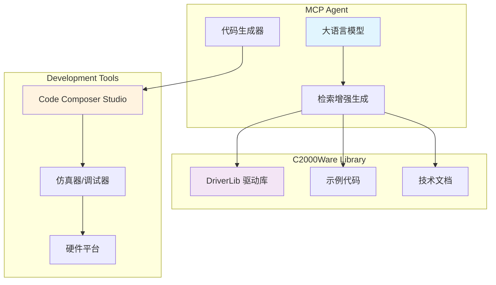

# TMS320F28377D C2000Ware 开发库

<div align="center">
  
  
  [](LICENSE)
  [](https://www.ti.com/c2000)
  [](https://www.ti.com/tool/C2000WARE)
  [](https://modelcontextprotocol.io/)
</div>

## 📋 概述

本仓库保存了完整的 **TMS320F28377D 系列** C2000Ware 开发库，专门优化用于 **大模型 MCP 协议** 进行智能检索和参考。该库提供了标准化的 DriverLib API 接口，简化 TMS320F28377D 实时控制微控制器的开发工作。

## 🚀 主要特性

### C2000Ware 特性
- ✅ **双核 C28x + CLA 架构支持**
- ✅ **完整的外设驱动库**
- ✅ **高性能实时控制算法**
- ✅ **数字电源控制优化**
- ✅ **电机控制专用库**

### DriverLib 特性  
- ⚡ **硬件抽象层简化编程**
- ⚡ **优化的实时性能**
- ⚡ **模块化外设驱动**
- ⚡ **跨平台兼容性**
- ⚡ **完整的示例代码**

## 📁 目录结构

```
TMS320F28377D/
├── 📄 README.md                      # 项目说明文档
├── 📁 device_support/                # 设备支持文件
│   └── f2837xd/
│       ├── common/                   # 通用支持文件
│       │   ├── cmd/                  # 链接脚本文件
│       │   ├── include/              # 头文件目录
│       │   ├── source/               # 源文件目录
│       │   └── targetConfigs/        # 目标配置
│       ├── docs/                     # 官方文档
│       ├── examples/                 # 示例代码
│       │   ├── cpu1/                 # CPU1 示例
│       │   └── dual/                 # 双核示例
│       └── headers/                  # 寄存器头文件
├── 📁 docs/                          # 中文技术文档
│   ├── 28377D勘误表.pdf
│   ├── 28377D用户手册.pdf
│   ├── 使用 TMS320F2837x 实现三相永磁同步电机的场定向控制.pdf
│   ├── C2000引导加载.pdf
│   ├── C2000™ 微控制器的串行闪存编程.pdf
│   └── tms320f28377d数据表.pdf
└── 📁 driverlib/                     # 驱动库目录
    └── f2837xd/
        ├── driverlib/                # DriverLib 源码
        │   ├── *.c                   # 驱动源文件
        │   ├── *.h                   # 驱动头文件
        │   ├── ccs/                  # CCS 项目文件
        │   └── inc/                  # 包含文件
        └── examples/                 # DriverLib 示例
```

## 🎯 支持的 TMS320F28377D 系列

| 型号 | 描述 | 特性 |
|------|------|------|
| **TMS320F28377D** | Delfino™ 双核实时控制器 | 200MHz C28x + 200MHz CLA，1MB Flash |
| **TMS320F28375D** | 高性能双核控制器 | 200MHz C28x + CLA，512KB Flash |
| **TMS320F28374D** | 性能优化控制器 | 200MHz C28x + CLA，1MB Flash |
| **TMS320F28376D** | 企业级控制器 | 200MHz C28x + CLA，1MB Flash，增强安全 |

## 🔧 支持的外设驱动

<details>
<summary><strong>📡 通信外设</strong></summary>

- **SCI** - 串行通信接口
- **SPI** - 串行外设接口
- **I2C** - 两线式串行接口
- **CAN** - 控制器区域网络
- **McBSP** - 多通道缓冲串行端口
- **USB** - 通用串行总线
- **EMIF** - 外部存储器接口
- **UPP** - 通用并行端口
</details>

<details>
<summary><strong>⏱️ 定时器与PWM</strong></summary>

- **ePWM** - 增强型脉宽调制器
- **HRPWM** - 高分辨率PWM
- **eCAP** - 增强型捕获单元
- **eQEP** - 增强型正交编码器脉冲
- **CPU Timer** - CPU定时器
</details>

<details>
<summary><strong>🔌 模拟外设</strong></summary>

- **ADC** - 模数转换器（12位，3.5MSPS）
- **DAC** - 数模转换器
- **CMPSS** - 比较器子系统
- **SDFM** - Sigma-Delta滤波器模块
</details>

<details>
<summary><strong>🎛️ 控制与系统</strong></summary>

- **GPIO** - 通用输入输出
- **XBAR** - 交叉开关
- **CLB** - 可配置逻辑块
- **DMA** - 直接内存访问
- **CLA** - 控制律加速器
- **IPC** - 核间通信
</details>

<details>
<summary><strong>💾 存储器与系统</strong></summary>

- **Flash** - 闪存控制器
- **MemCfg** - 存储器配置
- **SysCtl** - 系统控制
- **DCSM** - 双区代码安全模块
- **ASYSCTL** - 模拟系统控制
</details>

## 🤖 MCP 协议支持

本仓库专门优化用于 **Model Context Protocol (MCP)** 协议，支持大模型进行智能检索：

### 🔍 检索优化特性
- **📚 结构化文档组织** - 清晰的目录结构便于定位
- **🔗 完整的 API 参考** - 详细的函数说明和参数
- **💡 丰富的代码示例** - 实用的使用案例
- **🔄 跨核编程支持** - CPU1/CPU2/CLA 协同开发
- **📝 中文文档支持** - 本土化技术文档

### 🎯 适用场景
- 🤖 **AI 辅助编程** - 大模型理解 C2000 DriverLib API
- 📖 **智能文档查询** - 快速定位相关函数和配置
- 🔧 **代码生成协助** - 基于 DriverLib 的代码自动生成
- 🐛 **调试支持** - 错误诊断和解决方案推荐
- ⚡ **实时控制算法** - 电机控制和数字电源算法优化

## 📋 版本信息

- **📅 当前版本**: C2000Ware V5.00.00.00
- **🔧 兼容性**: TI Code Composer Studio 生态系统
- **🏗️ 构建系统**: 支持 CCS、IAR、Keil 等主流工具链
- **🎯 目标器件**: TMS320F2837xD 系列微控制器

## ⚠️ TMS320F28377D 系列特殊说明

### 双核架构
```c
// TMS320F28377D 双核配置
// ✅ CPU1: 主控制核心，200MHz C28x
// ✅ CPU2: 辅助控制核心，200MHz C28x  
// ✅ CLA: 控制律加速器，200MHz
// ✅ 核间通信：IPC 消息传递和共享内存
// ⚡ 并行处理能力大幅提升
```

### 时钟系统
- 🔄 最大系统时钟：200MHz（C28x + CLA）
- 🎯 内部振荡器：10MHz INTOSC
- ⚡ 外部振荡器：支持 3-40MHz
- 🔧 PLL 支持：SYSPLL + AUXPLL 双锁相环

### 高精度PWM
- 🚀 **HRPWM** - 150ps 高分辨率PWM
- ⚡ **ePWM** - 16通道增强型PWM
- 🎯 **死区控制** - 可编程死区时间
- 🔧 **故障保护** - 硬件故障检测

## 🚀 快速开始

### 1. 基础配置
```c
#include "F28x_Project.h"

// 系统初始化
void InitSysCtrl(void);
InitSysCtrl();

// GPIO 初始化示例
InitGpio();
EALLOW;
GpioCtrlRegs.GPAMUX1.bit.GPIO0 = 0;    // GPIO功能
GpioCtrlRegs.GPADIR.bit.GPIO0 = 1;     // 输出方向
GpioDataRegs.GPASET.bit.GPIO0 = 1;     // 输出高电平
EDIS;
```

### 2. ePWM 配置示例
```c
// ePWM 初始化
void InitEPwm1Example(void)
{
    EALLOW;
    
    // ePWM 模块时钟使能
    CpuSysRegs.PCLKCR2.bit.EPWM1 = 1;
    
    // 基本配置
    EPwm1Regs.TBCTL.bit.CTRMODE = TB_COUNT_UP;      // 向上计数
    EPwm1Regs.TBPRD = 1000;                         // 周期寄存器
    EPwm1Regs.CMPA.bit.CMPA = 500;                  // 比较A值
    EPwm1Regs.AQCTLA.bit.CAU = AQ_CLEAR;            // 上升沿清零
    EPwm1Regs.AQCTLA.bit.ZRO = AQ_SET;              // 零点置位
    
    EDIS;
}
```

### 3. ADC 配置示例
```c
// ADC 初始化
void InitAdc(void)
{
    EALLOW;
    
    // ADC 时钟使能
    CpuSysRegs.PCLKCR13.bit.ADC_A = 1;
    CpuSysRegs.PCLKCR13.bit.ADC_B = 1;
    
    // ADC 基本配置
    AdcaRegs.ADCCTL2.bit.PRESCALE = 6;              // ADC时钟分频
    AdcSetMode(ADC_ADCA, ADC_RESOLUTION_12BIT, ADC_SIGNALMODE_SINGLE);
    
    // ADC 校准
    AdcaRegs.ADCCTL1.bit.ADCPWDNZ = 1;              // 上电
    DELAY_US(1000);                                  // 延时1ms
    
    EDIS;
}
```

### 4. 核间通信示例
```c
// CPU1 发送消息到 CPU2
void CPU1_to_CPU2_IPC(void)
{
    // 写入共享内存
    *((Uint16 *)&RamfuncsLoadStart) = 0x1234;
    
    // 发送IPC中断
    IpcRegs.IPCSET.bit.IPC1 = 1;
    
    // 等待CPU2响应
    while(IpcRegs.IPCSTS.bit.IPC1 == 1);
}
```

## 📚 学习资源

### 📖 官方文档
- [📘 TMS320F2837xD 技术参考手册](docs/28377D用户手册.pdf)
- [📙 TMS320F28377D 数据表](docs/tms320f28377d数据表.pdf)  
- [📗 C2000Ware DriverLib 用户指南](https://software-dl.ti.com/C2000/docs/C2000_driverlib_api_guide/f2837xd/build/html/)
- [📊 电机控制应用笔记](docs/使用%20TMS320F2837x%20实现三相永磁同步电机的场定向控制.pdf)

### 🔗 相关链接
- [🏠 Texas Instruments 官网](https://www.ti.com)
- [🎯 C2000 产品页面](https://www.ti.com/c2000)
- [🧰 C2000Ware 软件包](https://www.ti.com/tool/C2000WARE)
- [🤝 TI E2E 社区](https://e2e.ti.com)

## 🔧 开发工具支持

### IDE 支持
- **Code Composer Studio** - TI 官方集成开发环境
- **IAR Embedded Workbench** - IAR Systems 开发环境  
- **Keil MDK-ARM** - ARM 官方开发套件
- **Visual Studio Code** - 轻量级跨平台编辑器

### 调试工具
- **XDS110** - TI 官方调试器
- **XDS200** - 高性能调试器
- **LAUNCHXL-F28379D** - 官方开发板

### 仿真工具
- **TMDSCNCD28377D** - controlCARD 仿真器
- **TMDSEMU110-U** - XDS110 仿真器
- **TMDSEMU200-U** - XDS200 仿真器

## 🤖 与 MCP 服务对接

本仓库专门为 **Model Context Protocol (MCP)** 优化，实现智能代码检索和自动生成：

| 需求       | 解决方案                                                  |
| -------- | ----------------------------------------------------- |
| **代码检索** | 结构化目录索引，支持语义化搜索和精准定位 |
| **示例调用** | 标准化函数入口，便于 LLM 理解和代码生成 |
| **智能补丁** | 基于 DriverLib API 的自动代码补全和错误修复 |
| **文档整合** | 中英文技术文档统一索引，提供全面参考 |

**架构关系图**



## 📄 许可证信息

**⚖️ 版权所有 © Texas Instruments Incorporated**

本仓库遵循 **TI TSPA** 许可证。一切版权归 **Texas Instruments 官方** 所有。

- 📜 TI 原始示例遵循 `TI TSPA license`
- 🔍 本仓新增脚本与文档采用 `MIT` 许可
- 📚 使用时请遵守相关许可协议
- 📖 详细许可信息请参见 [LICENSE](LICENSE) 文件

## 🤝 贡献说明

欢迎为本仓库贡献力量！

### 贡献流程
1. **🍴 Fork** 本仓库到您的账户
2. **🌿 新建分支** 进行功能开发或问题修复
3. **✅ 本地测试** 确保代码质量和功能正确性
4. **📤 提交 PR** 详细描述您的更改内容
5. **👁️ 代码审查** 等待维护者审查和合并

### 开发规范
- 📋 遵循 TI C2000 编程规范
- 📝 提供清晰的提交说明
- 🧪 确保代码通过编译测试
- 📚 更新相关文档

### 问题反馈
- 🐛 **技术问题**: 提交 [GitHub Issues](https://github.com/your-org/TMS320F28377D-C2000Ware-Examples-for-MCP/issues)
- 💬 **社区讨论**: 访问 [TI E2E 论坛](https://e2e.ti.com)
- 📧 **商业支持**: 联系 TI 官方技术支持

## 🏷️ 标签

`TMS320F28377D` `C2000` `DriverLib` `实时控制` `电机控制` `数字电源` `双核` `CLA` `MCP` `大模型` `嵌入式`

---

<div align="center">
  <p><strong>🎯 本仓库旨在提供便捷的 TMS320F28377D 开发参考，配合大模型工具提升实时控制系统开发效率</strong></p>
  <p><em>⭐ 如果这个仓库对您有帮助，请给个 Star！</em></p>
  
  <p>
    <a href="https://www.ti.com/c2000">🏠 官方主页</a> •
    <a href="https://e2e.ti.com">💬 技术论坛</a> •
    <a href="https://www.ti.com/tool/C2000WARE">📦 C2000Ware</a> •
    <a href="docs/">📚 技术文档</a>
  </p>
</div>
