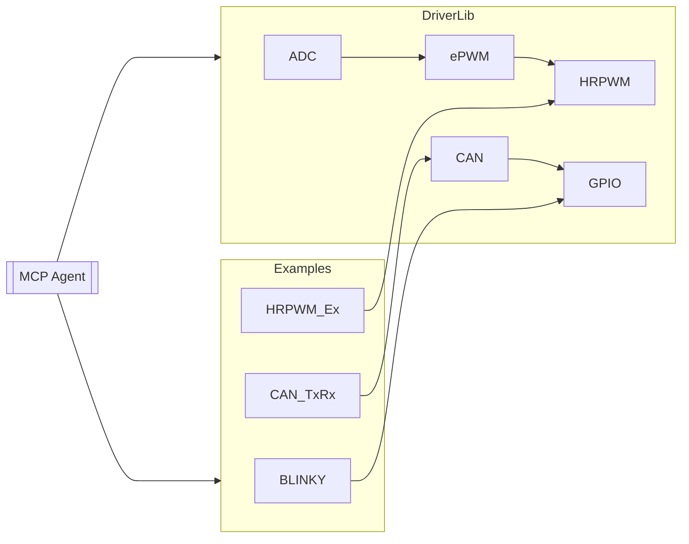

# TMS320F28377D-C2000Ware-Examples-for-MCP

本仓库收集并整理了 TI 官方 **C2000Ware** 中针对 **TMS320F28377D**（F2837xD 系列）微控制器的全部示例、驱动库及配套脚本，配合自定义元数据与目录规范，便于在线大模型（Model-Centric Programming，MCP）进行代码解析、知识检索和自动生成工程。  
> 目标：**一键检索 → 自动分析 → 直接调用**。

---

## 📚 背景

- **TMS320F28377D** 属于 Delfino™ Dual-Core C28x + CLA 实时控制 MCU，面向数字电源、伺服驱动与电机控制等高性能场景。:contentReference[oaicite:0]{index=0}  
- **C2000Ware** 提供驱动库 (`driverlib`)、外设示例、库源码及文档，是官方推荐的开发起点。:contentReference[oaicite:1]{index=1}  

---

## 🗂️ 目录结构

```text
.
├── device/                     # 设备支持文件（头文件、链接脚本）
│   └── f2837xd/
├── driverlib/                  # 官方 Driver Library 源码
├── examples/                   # 原生例程，按外设→CPU 核划分
│   ├── cpu1/
│   └── cpu2/
├── libraries/                  # DSP、ControlSUITE 兼容库
├── tools/                      # Flash 量产、脚本、初始化表
├── scripts/                    # 本仓专用：MCP 元数据生成 & CI
├── docs/                       # 数据手册、TRM、应用笔记（PDF 链接）
└── README.md                   # 当前文件
````

> 所有路径均保持与原版 C2000Ware 相对一致，方便官方文档与 IDE 工程直接引用。

---

## 🚀 快速开始

1. **克隆仓库**

   ```bash
   git clone --recursive https://github.com/your-org/TMS320F28377D-C2000Ware-Examples-for-MCP.git
   cd TMS320F28377D-C2000Ware-Examples-for-MCP
   ```

2. **安装环境**

   | 工具                   | 建议版本         |
   | -------------------- | ------------ |
   | Code Composer Studio | ≥ 12.5       |
   | C2000Ware            | ≥ 5.00.00.00 |
   | Python（可选脚本）         | 3.9 – 3.12   |

   > 在 `settings.json` 或环境变量中设置 `C2000WARE_ROOT` 指向本仓根目录。

3. **编译示例**

   * 进入任一示例文件夹（如 `examples/cpu1/epwm/epwm_ex1`）。
   * 打开 `*.projectspec` 直接导入 CCS；
   * 或运行 `gmake all` 使用 CLI 构建。

4. **烧录/调试**

   通过 `LAUNCHXL-F28379D`、`TMDSCNCD28377D` 等仿真器，使用 CCS 或 `c2000-flash-programmer`。

---

## 🤖 与 MCP 服务对接

| 需求       | 解决方案                                                  |
| -------- | ----------------------------------------------------- |
| **代码检索** | `scripts/indexer.py` 解析目录生成 `code-map.json`，供 RAG 检索。 |
| **示例调用** | 统一函数入口 `main.c → <example>_init()`，方便 LLM 生成 patch。   |
| **自动补丁** | PR 模板内嵌 GPT-based  CI Bot，检测编译结果并回帖报告。                |

**Mermaid 依赖关系示意**



---

## 🛠️ 贡献指南

1. Fork → 新建分支 → 提交 PR。
2. 确保通过 `./scripts/run_ci.sh` 本地测试。
3. 遵循 `docs/CODING_STYLE.md`（基于 TI driverlib 规范）。

---

## 📜 许可证

TI 原始示例遵循 `TI TSPA license`；本仓新增脚本与文档采用 MIT 许可，详见 `LICENSE` 文件。

---

## 🔗 参考资料

* TI C2000Ware 官方仓库（核心 SDK）([github.com][1])
* C2000Ware 产品页 & 下载 ([ti.com][2])
* *TMS320F2837xD Technical Reference Manual* (SPRUHM8) ([ti.com][3])

欢迎 Star & Watch 以获取最新更新！

```

[1]: [https://github.com/TexasInstruments/c2000ware-core-sdk](https://github.com/TexasInstruments/c2000ware-core-sdk)
[2]: [https://www.ti.com/tool/C2000WARE?utm_source=chatgpt.com "C2000WARE Software development kit (SDK) | TI.com"](https://software-dl.ti.com/C2000/docs/C2000_driverlib_api_guide/f2837xd/build/html/)
